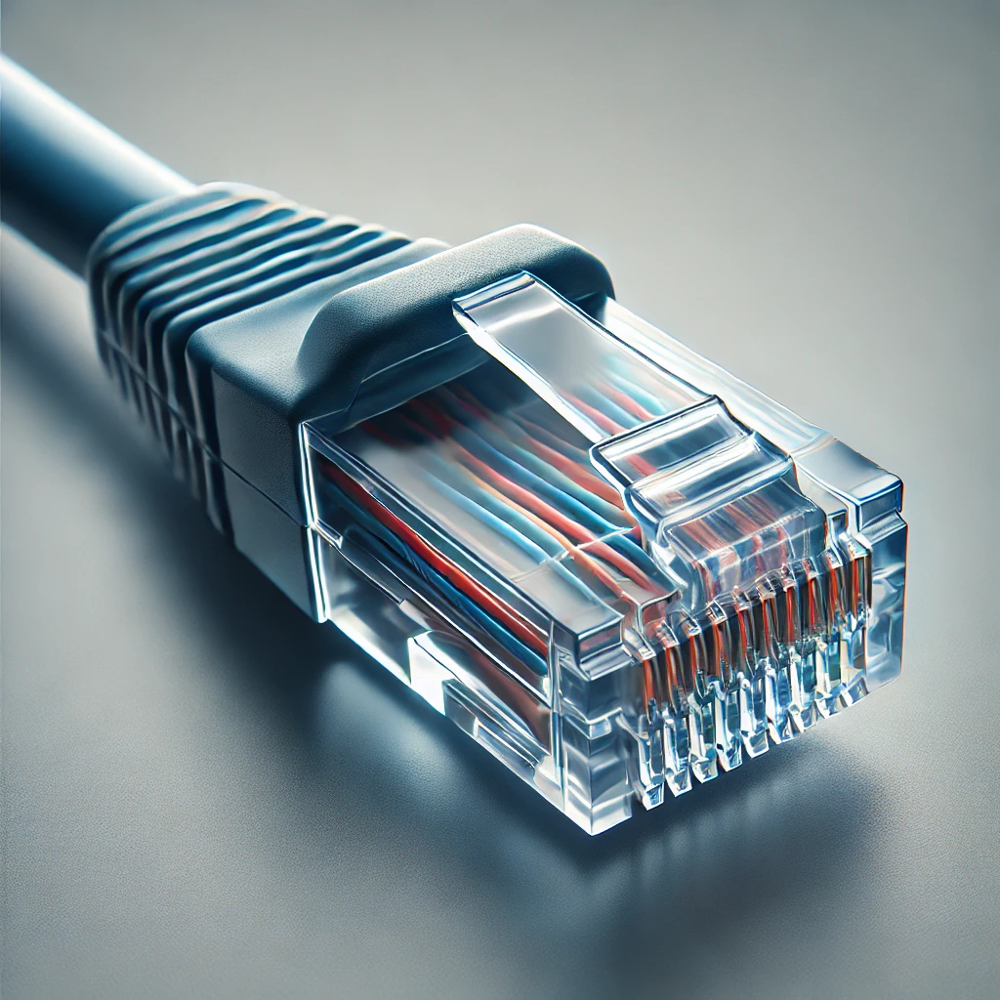

= Les composants d'un réseau
:revealjs_theme: beige
:source-highlighter: highlight.js
:icons: font

== Introduction

Les composants d'un réseau sont essentiels pour:
[%step]
* permettre la communication entre les différents dispositifs, 
* assurer la connectivité,
* garantir le bon fonctionnement des flux de données. 

== Routeur

Un routeur est un appareil réseau qui assure la communication entre plusieurs réseaux différents, comme un réseau local (LAN) et l'Internet. 

=== ...

Il détermine le meilleur chemin pour faire transiter les paquets de données vers leur destination.

=== Fonction : 

acheminer les paquets de données entre différents réseaux.

=== Exemple : 

[%step]
* routeur domestique, 
* routeur d’entreprise
* routeur edge.

=== Utilisation : 

connecter un LAN à l'Internet ou à un autre réseau LAN.

== Switch (Commutateur)

Un switch est un équipement réseau qui connecte plusieurs appareils au sein d'un même réseau local (LAN) et permet l'échange de données entre eux.

=== ...

Il fonctionne au niveau de la couche 2 (liaison de données) du modèle OSI et utilise les adresses MAC pour transférer les données.

=== Fonction : 

connecter des dispositifs dans un réseau local et acheminer les données aux bons destinataires.

=== Exemple : 

switchs d’accès dans une entreprise ou un campus.

=== Utilisation : 

interconnecter: 
[%step]
* des ordinateurs, 
* serveurs, 
* imprimantes au sein d'un même réseau.

== Point d'Accès (Access Point - AP)

Un point d'accès est un dispositif qui permet aux appareils sans fil (Wi-Fi) de se connecter à un réseau filaire. 

=== ...

Il étend la connectivité sans fil et peut faire partie d'un LAN pour couvrir de grandes zones.

=== Fonction : 

fournir la connectivité Wi-Fi à des appareils tels que des ordinateurs portables, des téléphones mobiles, des tablettes.

=== Exemple : 

point d’accès Wi-Fi dans un bureau ou un espace public.

=== Utilisation : 

fournir une connexion sans fil au réseau dans des espaces définis.

== Câbles Réseau

Les câbles réseau (comme le câble Ethernet) sont utilisés pour connecter les différents composants d'un réseau. 

=== ...

Ils transmettent les données sous forme de signaux électriques ou optiques.

=== Types courants :

=== Câble Ethernet (RJ45) : 

=== ...

utilisé dans la majorité des réseaux locaux pour des connexions filaires.

=== Câble fibre optique : 

pour des connexions à très haut débit, sur de longues distances.

=== Utilisation : 

connecter des routeurs, switchs, ordinateurs et autres dispositifs au sein d’un LAN.

== Serveur

Un serveur est un ordinateur ou un dispositif puissant qui fournit des services, des ressources et des données à d'autres dispositifs appelés clients dans un réseau. 

=== ...

Les serveurs peuvent héberger des applications, des fichiers, des bases de données, etc.

=== Fonction : 

centraliser les services réseau, les données et les ressources.

=== Exemple : 

serveurs de fichiers, serveurs d’applications, serveurs Web.

=== Utilisation : 

gérer et fournir des ressources pour l’ensemble du réseau.

== Pare-feu (Firewall)

Un pare-feu est un dispositif de sécurité réseau qui surveille et contrôle le trafic réseau entrant et sortant, selon des règles de sécurité prédéfinies. 

=== ...

Il peut être matériel ou logiciel.

=== Fonction : 

protéger le réseau contre les menaces et les accès non autorisés.

=== Exemple : 

pare-feu d’entreprise, pare-feu sur routeur domestique.

=== Utilisation : 

Sécuriser les connexions réseau et prévenir les intrusions.

== Passerelle (Gateway)

Une passerelle est un appareil qui permet la communication entre des réseaux utilisant des protocoles différents. 

=== ...

Elle traduit les protocoles pour que les différents systèmes puissent interagir.

=== Fonction : 

Permettre l'interconnexion entre des réseaux hétérogènes.

=== Exemple : 

Passerelle Internet, passerelle IoT.

=== Utilisation : 

convertir et acheminer le trafic entre différents protocoles et réseaux.

===  En savoir plus

* link:./zoom-passerelle.adoc[version adoc]
* link:./zoom-passerelle.html[version html]

== Carte réseau (NIC - Network Interface Card)

Une carte réseau est un composant matériel qui permet à un ordinateur ou à tout autre appareil de se connecter à un réseau, que ce soit via une connexion filaire ou sans fil.

=== Fonction : 

fournir l'interface matérielle pour se connecter à un réseau.

=== Exemple : 

cartes réseau Ethernet, cartes Wi-Fi.

=== Utilisation : 

permettre aux ordinateurs de communiquer dans un réseau local ou avec l'Internet.

== Modem

Un modem est un appareil qui convertit les signaux numériques des ordinateurs en signaux analogiques et vice versa, permettant ainsi la communication sur les lignes téléphoniques ou via la fibre optique.

=== Fonction : 

moduler et démoduler les signaux pour la transmission sur des lignes téléphoniques ou à large bande.

=== Exemple : 

modem ADSL, modem câble.

=== Utilisation : 

connecter un réseau domestique ou professionnel à l’Internet.

== Contrôleur d'accès (NAC - Network Access Control)

Un contrôleur d'accès réseau limite l’accès au réseau en fonction de l’identité des utilisateurs ou des dispositifs, renforçant ainsi la sécurité du réseau.

=== Fonction : 

contrôler qui peut se connecter au réseau et avec quels privilèges.

=== Exemple : 

système NAC pour les réseaux d’entreprise.

=== Utilisation : 

filtrer les accès et garantir la sécurité des connexions réseau.

== Cloud Networking (Composants Virtuels)

Avec la virtualisation et l’adoption croissante des services cloud, certains composants de réseau peuvent être virtuels. 

=== ...

Par exemple, des routeurs ou des pare-feux peuvent être mis en œuvre dans le cloud.

=== Fonction : 

Fournir des services réseau virtualisés et hébergés dans le cloud.

=== Exemple : 

Routeur cloud, Pare-feu cloud.

=== Utilisation : 

Gérer les réseaux d’entreprise sans avoir à déployer de matériel physique.

=== Mot de la fin :

Ces composants travaillent ensemble pour:
[%step]
* permettre la communication au sein des réseaux, 
* gérer les flux de données, 
* assurer la sécurité,
* faciliter les connexions. 

=== ...

La bonne combinaison et configuration de ces éléments sont essentielles pour:
[%step]
* garantir la performance, 
* la sécurité, 
* la résilience des réseaux modernes.

